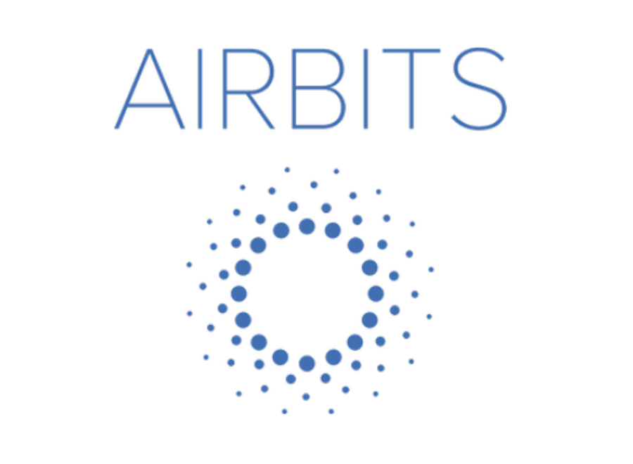
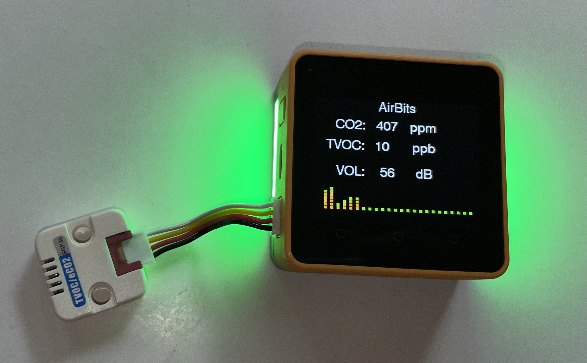

# AirBits



Walk through video https://youtu.be/ztfLtddiE5w

## What It Is

AirBits was developed for the [Reinventing Healthy Spaces with Amazon Web Services challenge](https://www.hackster.io/contests/Healthy-Spaces-with-AWS) and the [2022 China-US Young Maker Competition](https://www.hackster.io/contests/2022chinausyoungmakercompetition) 

Available on [Hackster.io](https://www.hackster.io/avantassel/airbits-ea8503).

The goal of AirBits is to keep you informed about the levels of CO2 and TVOCs in realtime for indoor spaces before you enter or even while you are there.  These bits in the air can be dangerous to you when exposed at high levels for a period of time.  

As we have found out with the recent pandemic and COVID-19 (SARS-CoV-2), air flow and good ventilation in indoor spaces is critical for keeping you healthy.  High CO2 levels could mean there is poor air flow or simply that there are too many people in that space and you are best to get out of it ASAP.

AirBits measures CO2, TVOCs and decibel levels.  One or many devices could be installed in a space.  The realtime data will be displayed on the M5 Core2 device screen along with colored LED lights based on current levels.  This data is also sent in realtime to AWS, which would allow anyone in a geo-fenced area to be notified after installing an app.  This data could also be made available on any map app for indoor air quality (Google Maps, Apple Maps).

## Bourbon Street Hypothetical

Imagine you are walking down Bourbon Street in New Orleans where each bar or restaurant had an AirBits device sending realtime data to AWS.  You would have a smart phone app subscribed to the data stream that would notify you before entering a space.  

Or an employee working the door could regulate foot traffic into their establishment if levels started to rise.  Of course this could also be automated and built into digital signs in windows or automating door access.


## OSHA

According to OSHA, restaurant facility workers cannot be exposed to CO2 levels higher than 5,000 parts per million (ppm) over an 8-hour work day, which is about 0.5% of CO2 in the air. If exposure is short term, the limit is set to no more than 30,000 ppm for the duration of 10 minutes.

Source: http://air-source.com/blog/osha-safety-standards-for-monitoring-restaurant-gases

## CO2

*Health effects of high levels of carbon dioxide*

CO2 is considered to be minimally toxic by inhalation. The primary health effects caused by CO2 are the result of its behavior as a simple asphyxiant. A simple asphyxiant is a gas which reduces or displaces the normal oxygen in breathing air.

Symptoms of mild CO2 exposure may include headache and drowsiness. At higher levels, rapid breathing, confusion, increased cardiac output, elevated blood pressure and increased arrhythmias may occur.

Breathing oxygen depleted air caused by extreme CO2 concentrations can lead to death by
suffocation. 

Source: https://www.fsis.usda.gov/sites/default/files/media_file/2020-08/Carbon-Dioxide.pdf

## TVOC

*Health effects of high levels of volatile organic compounds*

Symptoms include eye, nose and throat irritation. Headaches, loss of coordination and nausea.  Long exposure to high levels can cause damage to liver, kidney and the central nervous system. Some organics can cause cancer in animals, some are suspected or known to cause cancer in humans.

Source: https://www.epa.gov/indoor-air-quality-iaq/volatile-organic-compounds-impact-indoor-air-quality


## Decibels

*Health effects of high sound levels*

| dB | Damage |
|---|---|
| 80 - 85 | Damage to hearing possible after 2 hours of exposure |
| 95 | Damage to hearing possible after about 50 minutes of exposure |
| 100 | Hearing loss possible after 15 minutes |
| 105 - 110 | Hearing loss possible in less than 5 minutes |
| 110 | Hearing loss possible in less than 2 minutes |
| 120 | Pain and ear injury 
| 140 - 150 | Pain and ear injury


Source: https://www.cdc.gov/nceh/hearing_loss/what_noises_cause_hearing_loss.html

## Components

- [M5 AWS Core2](https://shop.m5stack.com/collections/stack-series/products/m5stack-core2-esp32-iot-development-kit-for-aws-iot-edukit)
- [SGP30](https://shop.m5stack.com/products/tvoc-eco2-gas-unit-sgp30) CO2 Sensor
- [SGP30](https://shop.m5stack.com/products/tvoc-eco2-gas-unit-sgp30) TVOC Total Volatile Organic Compounds
- [SPM1423](https://shop.m5stack.com/products/pdm-microphone-unit-spm1423) (Built into the M5 AWS Core2) microphone used to record decibel levels is an enhanced far-field MEMS microphone.

## Configuring AWS IOT

Thanks to a little help from this blog article, https://aws.amazon.com/blogs/compute/building-an-aws-iot-core-device-using-aws-serverless-and-an-esp32/

```sh
# copy the secrets file
cp secrets-sample.h secrets.h
```

Create a thing called `airbit` and download the certs, then paste those in [secrets-sample.h](secrets.h)

https://console.aws.amazon.com/iot/home?region=us-east-1#/thinghub

```sh
# Get the IOT Endpoint URL
aws configure
aws iot describe-endpoint --endpoint-type iot:Data-ATS
```

Paste that along with your WiFi ssid/pass in [secrets-sample.h](secrets.h)

This JSON will get posted to the thing activity tab every 5 seconds,

https://console.aws.amazon.com/iot/home?region=us-east-1#/thing/airbit?tab=activity

```json
{
  "state": {
    "reported": {
      "co2": 453,
      "tvoc": 10,
      "sound": 72,
      "decibels": 45
    }
  }
}
```

## Building

Open [airbits.ino](airbits.ino) with [Arduino Studio](https://www.arduino.cc/en/software).

## Device Options

- Button A
  - Toggle Sending to AWS IOT MQTT
- Button B
  - Toggle DarkMode

## TODO

- Add GPS module to send lat/lng in order to notify people in a geo-fenced area.
- Aggregate data to show hot spots on a map for bad indoor air quality.
- Build mobile app.